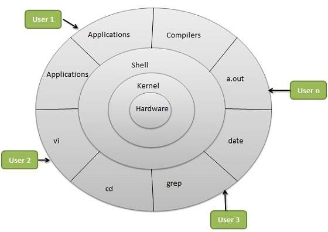

# My extent of demystification
I am trying to demystify the functioning of the computers from the very basic that I am able to apprehend to the very top I
can think of.

## 1. Hardware
It consists of the physical machinery of a computer like monitor, keyboard, ram, mouse, etc. Hardware can be majorly
divided into 5 categories:
#### 1. Input Devices
These devices take input from us. Examples: keyboard, mouse, microphone, etc.

#### 2. Output Devices
These devices give out output in different form apprehendable by us. Examples: monitor, speaker, printer, etc.

#### 3. Storage Devices
These devices temporarily or permanently store data. Examples: RAM, Hard disk, Pen drives, etc.

#### 4. Processing Unit
It works on the input given by input devices and storage elements, and produce output which is either manifested by
output devices or stored in storage devices.

#### 5. Communication Devices
These devices are used to send and/or recieve information. Eg: cables, router, etc.

## 2. Software
Software mainly refers to the untangible logic part of the computer which are the instructions used to perform tasks on
a computer.
I don't know much about general characterisation of software but will majorly be only talking about how as bottom to top
level instructions to use hardware have been coded.

### Programming Languages
Computer can only execute program written in form of **machine code** (0&1).
Since machine language is difficult to understand **programming languages** were developed which could be more easily
understood.
Programs written in them were changed to machine code using an already implemented program called **compiler**.

### Operating System
**Operating systems** were developed which is like a big program running on computer providing an easier interface for
end-user to use computer resources than directly controlling hardware with programs written in programming languages.
Example: Linux, Windows
<!---
operating system, compilers, kernel, shell, linux, gtk, qt, genome, kde, terminal, tty: http://www.linusakesson.net/programming/tty/index.php
-->
